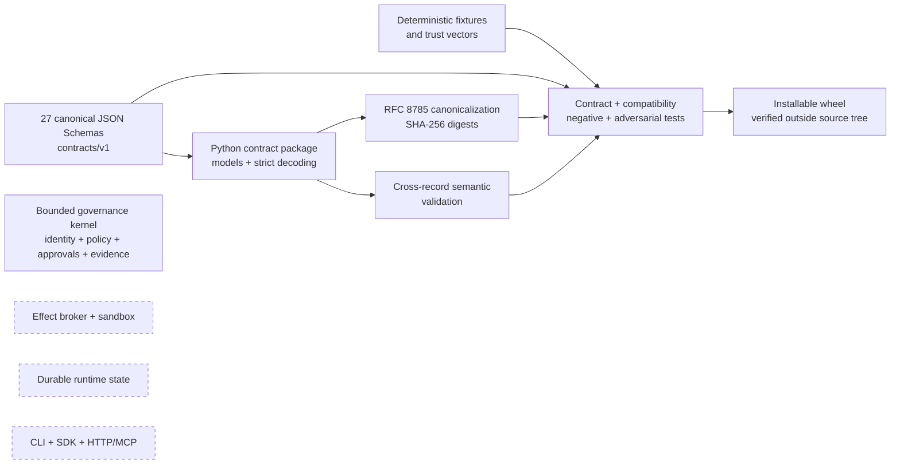
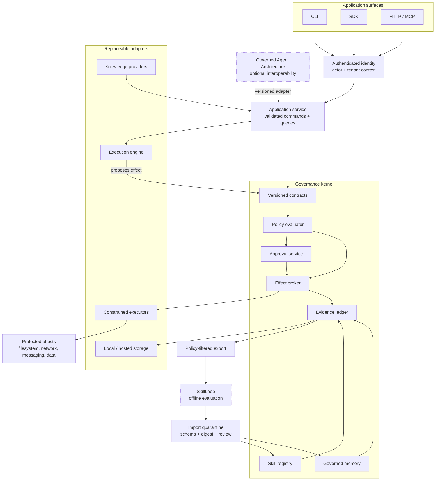
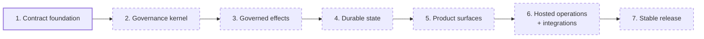

# Governed Agent Harness

[](https://github.com/lamenting-hawthorn/governed-agent-harness/actions/workflows/ci.yml)
[](https://www.python.org/)
[](LICENSE)

Governed Agent Harness is a local-first, contract-first foundation for agents
whose actions, memory, skills, and learning inputs are controlled by explicit
policy and recorded as evidence.

The project is runtime-neutral. It defines the trust boundaries required for
governed agent execution without coupling the kernel to one model provider,
transport, storage product, or learning workflow.

> **Project status:** the canonical contract foundation and a bounded,
> in-process governance kernel are implemented and tested. The kernel accepts
> identity only through an injected trust boundary, makes deterministic policy decisions, validates approvals against an injected current trust snapshot, and consumes approvals,
> and appends in-memory evidence before lifecycle transitions. It does not issue
> grants or execute effects. Durable state and product integrations remain
> planned. This repository is not yet a production-ready agent platform.

## Why this exists

Most agent systems begin with a model loop and add policy or audit afterward.
That leaves dangerous gaps: a tool can bypass policy, an approval can be reused
for changed arguments, memory can become trusted without evidence, and an
evaluation result can mutate live behavior without independent authorization.

Governed Agent Harness treats governance as part of the execution path:

```text
request -> trusted identity -> validated proposal -> policy decision
        -> approval when required -> evidence -> constrained execution
        -> outcome evidence -> governed result
```

The model proposes. The governance boundary decides. The evidence record makes
that decision inspectable and replayable.

## What is implemented today



| Surface | Status | Evidence |
| --- | --- | --- |
| Versioned schemas and catalog | Implemented | `contracts/v1/` |
| Strict JSON decoding and canonical bytes | Implemented | Python package and known-answer vectors |
| Typed models and semantic validation | Implemented | 27-record model registry and cross-record tests |
| Digest, trust, approval, and lifecycle bindings | Implemented | Positive, negative, and adversarial tests |
| Isolated wheel packaging | Implemented | Clean-environment installation test |
| Bounded in-process governance kernel | Implemented | Public-flow, negative-path, and adversarial lifecycle tests; no effect execution |
| Effect broker and sandbox | Planned | Requires end-to-end policy-before-effect proof |
| Durable runtime storage and governed memory | Planned | Requires restart, isolation, and recovery proof |
| CLI, SDK, HTTP/MCP, and hosted operations | Planned | Requires feature-level integration evidence |

## Contract foundation

The v1 protocol contains 27 closed JSON Schema records. Wire objects use a
fixed `schema_version`, lowercase `record_type`, UUIDv7 identifiers, RFC 3339
UTC timestamps, and tenant-bound references.

| Domain | Representative records | Purpose |
| --- | --- | --- |
| Identity and capability | `actor_context`, `capability_manifest` | Establish trusted actor, tenant, and supported enforcement level |
| Tools and policy | `tool_request`, `policy_decision`, `gate_decision` | Describe a proposed effect and its policy disposition |
| Approval and authorization | `approval_record`, `authorization_grant` | Bind authority to the exact request, policy, scope, and expiry |
| Evidence and outcomes | `evidence_draft`, `evidence_envelope`, `action_outcome` | Record causal, append-only execution evidence |
| Memory | `memory_scope`, `memory_proposal`, `memory_decision`, `memory_record` | Separate proposed knowledge from policy-approved durable memory |
| Skills and learning | `skill_proposal`, `learning_trace_envelope`, `evaluation_run` | Keep improvement artifacts versioned and inert by default |
| Delivery and lifecycle | `delivery_envelope`, `activation_receipt`, `rollback_receipt` | Validate installation, activation, historical trust, and rollback |

The schemas reject undeclared fields. The Python validators additionally enforce
properties that JSON Schema alone cannot prove, including canonical digests,
tenant agreement, chronology, scope narrowing, approval/request equality,
idempotency conflicts, proof-domain trust, and historical key validity.

See the [contract catalog](contracts/v1/catalog.json) and
[contract specification](docs/CONTRACTS.md).

## Quick start

Requires Python 3.11 or newer.

```console
git clone https://github.com/lamenting-hawthorn/governed-agent-harness.git
cd governed-agent-harness
python -m venv .venv
source .venv/bin/activate
python -m pip install -e '.[test]'
python -m governed_agent_harness.contracts.self_check
pytest -q
ruff check .
```

The self-check validates the complete model registry, deterministic fixtures,
cross-record bindings, proof trust, historical acceptance, and canonicalization
vectors. Tests require no production credentials, external services, or private
infrastructure.

### Canonicalization example

```python
from governed_agent_harness.contracts import canonical_bytes, sha256_digest

record = {
    "schema_version": "1.0",
    "record_type": "example_record",
    "tenant_id": "tenant.demo",
}

wire_bytes = canonical_bytes(record)
digest = sha256_digest(record)

assert wire_bytes == (
    b'{"record_type":"example_record","schema_version":"1.0",'
    b'"tenant_id":"tenant.demo"}'
)
assert digest.startswith("sha256:")
```

Canonicalization is not schema validation; boundary code should parse records
through the typed contract APIs before granting them authority.

## Completed target architecture



No execution engine, transport, provider, or learning system receives an
alternate path around identity, policy, evidence, or the effect broker.

## Non-negotiable invariants

- Every protected effect is evaluated synchronously before execution.
- Approval is bound to the exact normalized request and expires.
- The execution engine receives proxy tools, never raw effect capabilities.
- Failed identity, policy, approval, or evidence checks fail closed.
- Evidence is appended before authoritative derived state is projected.
- Memory promotion requires source evidence and a recorded policy decision.
- Tenant and actor scope comes from authenticated context, not model output.
- Learning artifacts remain inert until separately validated and activated.
- Public and persisted contracts are versioned and compatibility-tested.
- Security capability claims require executable proof for every declared path.

## Delivery roadmap



| Stage | Principal deliverables | Completion boundary |
| --- | --- | --- |
| Contract foundation | Schemas, validation, fixtures, packaging | Implemented and covered by the contract suite |
| Governance kernel | In-process identity propagation through an injected trust boundary, deterministic policy, exact approval binding, in-memory evidence-first lifecycle state | Implemented without grant issuance or effect execution |
| Governed effects | Engine boundary, effect broker, constrained executors | End-to-end policy-before-effect proof |
| Durable state | Ledger, projections, memory, skills | Restart, replay, isolation, idempotency, and recovery tests |
| Product surfaces | CLI, SDK, HTTP/MCP, diagnostics | Documented feature-level workflows through supported surfaces |
| Hosted operations and integrations | Tenant controls, telemetry, backup/restore, optional adapters | Cross-backend conformance and operational exercises |
| Stable release | Compatibility, migrations, security review, SBOM, signed artifacts | Published evidence and explicit support boundaries |

There are no dates attached to planned stages until their prerequisites and
acceptance evidence exist. The detailed path lives in the
[architecture guide](docs/ARCHITECTURE.md#delivery-path) and
[release strategy](docs/RELEASE_STRATEGY.md).

## Repository layout

```text
contracts/v1/                         canonical JSON Schema authority
src/governed_agent_harness/contracts/ Python models and validators
tests/contracts/                      deterministic and adversarial evidence
docs/                                 architecture, security, operations, ADRs
.github/workflows/                    continuous integration
pyproject.toml                        package and tool configuration
```

## Security posture

This project provides security-oriented contracts and validation tests; it does
not claim that the completed runtime or a production security posture already
exists. In particular:

- evidence is designed to be tamper-evident, not universally tamper-proof;
- signed-record helpers require a deployment-supplied proof verifier and trust
  policy;
- local contract tests do not prove hosted tenant isolation;
- sandboxing, secret brokerage, effect interception, and runtime enforcement
  remain planned implementation layers; and
- compliance or certification claims require deployment-specific evidence and
  independent review.

Read the [security model](docs/SECURITY_MODEL.md),
[threat model](docs/THREAT_MODEL.md), and [security reporting policy](SECURITY.md)
before extending a trust boundary. Please report vulnerabilities privately as
described in `SECURITY.md` rather than opening a public issue.

## Project relationship

Governed Agent Harness is an independent project with its own source and Git
history. It may interoperate with
[Governed Agent Architecture](docs/INTEGRATIONS.md#governed-agent-architecture-adapter)
and [SkillLoop](docs/EVALUATION_AND_LEARNING.md#skillloop-boundary) through
explicit, versioned boundaries. Neither project is required for the local
contract foundation, and neither can bypass this repository's governance
controls.

## Contributing

Contributions should be small, test-backed, and explicit about affected trust
boundaries. Security-sensitive changes require negative-path and adversarial
coverage; persisted contract changes require compatibility and migration
analysis. Start with [CONTRIBUTING.md](CONTRIBUTING.md), then review
[GOVERNANCE.md](GOVERNANCE.md) and the relevant architecture decision records.

## Documentation

| Area | Guide |
| --- | --- |
| Product direction | [Vision and scope](docs/VISION_AND_SCOPE.md) · [Product requirements](docs/PRODUCT_REQUIREMENTS.md) |
| System design | [Architecture](docs/ARCHITECTURE.md) · [Contracts](docs/CONTRACTS.md) · [Integrations](docs/INTEGRATIONS.md) |
| Trust | [Security model](docs/SECURITY_MODEL.md) · [Threat model](docs/THREAT_MODEL.md) · [Data governance](docs/DATA_GOVERNANCE.md) |
| Runtime concepts | [Memory and knowledge](docs/MEMORY_AND_KNOWLEDGE.md) · [Skills](docs/SKILLS.md) · [Evaluation and learning](docs/EVALUATION_AND_LEARNING.md) |
| Delivery | [Testing strategy](docs/TESTING_STRATEGY.md) · [Definition of done](docs/DEFINITION_OF_DONE.md) · [Release strategy](docs/RELEASE_STRATEGY.md) |
| Operations | [Observability and operations](docs/OBSERVABILITY_AND_OPERATIONS.md) · [Enterprise readiness](docs/ENTERPRISE_READINESS.md) |

## License

Released under the [Apache License 2.0](LICENSE).
