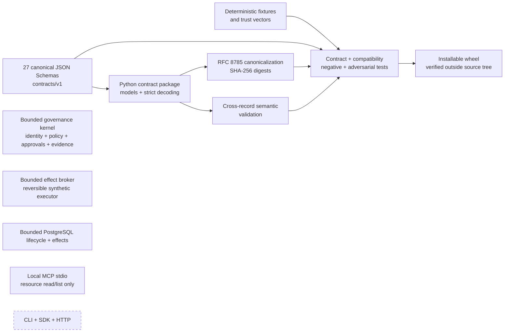
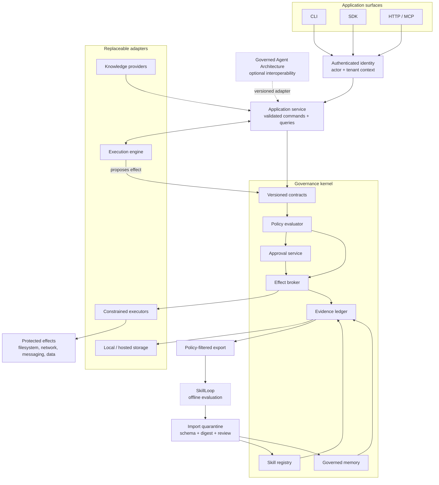
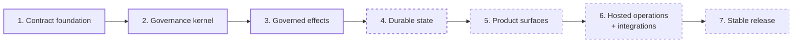

# Governed Agent Harness

[](https://github.com/lamenting-hawthorn/governed-agent-harness/actions/workflows/ci.yml)
[](https://www.python.org/)
[](LICENSE)

Governed Agent Harness is a local-first, contract-first foundation for agents
whose actions, memory, skills, and learning inputs are controlled by explicit
policy and recorded as evidence.

The project is runtime-neutral. It defines the trust boundaries required for
governed agent execution without coupling the kernel to one model provider,
transport, storage product, or learning workflow.

> **Project status:** the canonical contract foundation and a bounded,
> in-process governance kernel are implemented and tested. The kernel accepts
> identity only through an injected trust boundary, makes deterministic policy
> decisions, validates and consumes approvals, issues exact-binding five-minute
> authorization grants, and routes the implemented synthetic effect path through
> one evidence-first broker. An optional PostgreSQL-backed Phase 4 store now
> durably records the governed pre-effect lifecycle, commits effect intent and
> exact grant consumption, records validated outcomes, and reconstructs state
> after restart. Checksummed migrations fail closed on drift. Fenced execution
> attempts use database leases and permit indeterminate recovery only after
> expiry; stale owners cannot append terminal evidence. The deterministic executor
> remains injected and synthetic. Phase 4.2 adds actor-scoped, read-only memory
> retrieval through a restricted PostgreSQL function with forced RLS,
> deterministic ranking, revision/tombstone/temporal filtering, provenance, and
> result limits. Phase 4.3 adds authority-only, evidence-backed create, revise,
> same-memory supersede, and logical tombstone transitions with atomic ledger
> evidence, optimistic concurrency, exact replay, and projection rebuild. Phase
> 4.4 adds an actor-scoped inert skill registry with immutable artifact revisions,
> explicit authority-only activation/rollback/deactivation, canonical evidence,
> rebuildable active-digest projection, and a runtime-only exact-digest resolver.
> Phase 5.1 composes that resolver with one authority-issued, single-use,
> expiring authorization and exactly one preinstalled deterministic echo
> handler selected by a static host registry. Stored artifact text is never
> interpreted or executed. Phase 5.2 adds one actor-scoped, immutable GitHub
> Markdown knowledge source through an application-injected, credential-free
> pinned reader, evidence-backed durable revisions, logical source revocation,
> cited read-only PostgreSQL retrieval, and an explicitly untrusted resource
> shape. Phase 5.3 adds a local-only MCP 2026-07-28 stdio resource adapter
> using an owner-only project/ActorContext bootstrap and runtime-principal
> database binding. It exposes only bounded `resources/list` and exact
> `resources/read`; it is not remote MCP or hosted operation.
> `isolation_profile="none"` is not a sandbox. Provider effects, general
> sandboxing, and hosted operations remain out of scope.
> This repository is not production-ready.

## Why this exists

Most agent systems begin with a model loop and add policy or audit afterward.
That leaves dangerous gaps: a tool can bypass policy, an approval can be reused
for changed arguments, memory can become trusted without evidence, and an
evaluation result can mutate live behavior without independent authorization.

Governed Agent Harness treats governance as part of the execution path:

```text
request -> trusted identity -> validated proposal -> policy decision
        -> approval when required -> evidence -> constrained execution
        -> outcome evidence -> governed result
```

The model proposes. The governance boundary decides. The evidence record makes
that decision inspectable and replayable.

## What is implemented today


```mermaid
flowchart LR
  Schemas["27 canonical JSON Schemas\ncontracts/v1"] --> Package["Python contract package\nmodels + strict decoding"]
  Package --> Canonical["RFC 8785 canonicalization\nSHA-256 digests"]
  Package --> Semantic["Cross-record semantic\nvalidation"]
  Fixtures["Deterministic fixtures\nand trust vectors"] --> Tests["Contract + compatibility\nnegative + adversarial tests"]
  Schemas --> Tests
  Canonical --> Tests
  Semantic --> Tests
  Tests --> Wheel["Installable wheel\nverified outside source tree"]

  Kernel["Bounded governance kernel\nidentity + policy + approvals + evidence"]
  Effects["Bounded effect broker\nreversible synthetic executor"]
  Storage["Bounded PostgreSQL lifecycle + effects"]
  LocalMcp["Local MCP stdio\nresource read/list only"]
  Surfaces["CLI + SDK + HTTP"]:::planned

  classDef planned stroke-dasharray:5 5
```

| Surface | Status | Evidence |
| --- | --- | --- |
| Versioned schemas and catalog | Implemented | `contracts/v1/` |
| Strict JSON decoding and canonical bytes | Implemented | Python package and known-answer vectors |
| Typed models and semantic validation | Implemented | 27-record model registry and cross-record tests |
| Digest, trust, approval, and lifecycle bindings | Implemented | Positive, negative, and adversarial tests |
| Isolated wheel packaging | Implemented | Clean-environment installation test |
| Bounded in-process governance kernel | Implemented | Public-flow, negative-path, and adversarial lifecycle tests |
| Bounded governed effects | Implemented | Exact signed grant, one broker, intent-before-executor evidence, outcome evidence, replay/concurrency proof, and a reversible synthetic executor only |
| Sandbox and provider executors | Planned | Requires independently proved isolation and provider-specific enforcement |
| PostgreSQL governed lifecycle/effect authority | Implemented, bounded | Checksummed migrations, canonical lifecycle evidence, rebuildable projection, runtime-role/RLS tests, atomic prepare/consume, fenced leases, replay, restart, concurrency, and expired-lease recovery |
| Actor-scoped governed memory retrieval | Implemented, bounded | PostgreSQL-only read path; latest revisions, tombstones, temporal/category filters, provenance, limits, restart equivalence, and adversarial role/RLS proof |
| Governed memory promotion | Implemented, bounded | Actor-only PostgreSQL authority path with exact proposal/evidence/policy/approval bindings, atomic evidence and revision persistence, replay, concurrency, tombstones, restart, rebuild, forced RLS, and runtime denial |
| Governed inert skill lifecycle | Implemented, bounded | Actor-only PostgreSQL install/activate/rollback/deactivate/rebuild authority; immutable inline JSON artifacts, canonical evidence, replay/concurrency, forced RLS, role separation, restart/rebuild, and runtime-only exact active-digest resolution |
| Built-in execution admission | Implemented, narrowly bounded | Exact active digest plus request/policy/gate/approval/evidence/validity/retention binding; authority-only five-minute grant issuance; runtime-only single-use consume; one static deterministic echo handler; canonical intent/outcome evidence; replay, fencing, recovery, and rebuild |
| Pinned GitHub Markdown knowledge | Implemented, narrowly bounded | One actor-scoped Markdown file at a full immutable SHA through an injected credential-free reader; exact policy/evidence binding, immutable revisions, logical revocation, cited untrusted PostgreSQL retrieval, runtime/authority separation, and a local-only read-only MCP stdio adapter; no live GitHub connector, remote MCP, or hosted operation |
| Local MCP stdio resources | Implemented, narrowly bounded | MCP 2026-07-28 `resources/list` and exact `resources/read` only, owner-only project/ActorContext bootstrap, runtime-principal DB binding, private zero-TTL cache hints, and no write/approval/raw-ledger surface |
| CLI, general SDK, HTTP/remote MCP, and hosted operations | Planned | Requires feature-level integration evidence |

## Contract foundation

The v1 protocol contains 27 closed JSON Schema records. Wire objects use a
fixed `schema_version`, lowercase `record_type`, UUIDv7 identifiers, RFC 3339
UTC timestamps, and tenant-bound references.

| Domain | Representative records | Purpose |
| --- | --- | --- |
| Identity and capability | `actor_context`, `capability_manifest` | Establish trusted actor, tenant, and supported enforcement level |
| Tools and policy | `tool_request`, `policy_decision`, `gate_decision` | Describe a proposed effect and its policy disposition |
| Approval and authorization | `approval_record`, `authorization_grant` | Bind authority to the exact request, policy, scope, and expiry |
| Evidence and outcomes | `evidence_draft`, `evidence_envelope`, `action_outcome` | Record causal, append-only execution evidence |
| Memory | `memory_scope`, `memory_proposal`, `memory_decision`, `memory_record` | Separate proposed knowledge from policy-approved durable memory |
| Skills and learning | `skill_proposal`, `learning_trace_envelope`, `evaluation_run` | Keep improvement artifacts versioned and inert by default |
| Delivery and lifecycle | `delivery_envelope`, `activation_receipt`, `rollback_receipt` | Validate installation, activation, historical trust, and rollback |

The schemas reject undeclared fields. The Python validators additionally enforce
properties that JSON Schema alone cannot prove, including canonical digests,
tenant agreement, chronology, scope narrowing, approval/request equality,
idempotency conflicts, proof-domain trust, and historical key validity.

See the [contract catalog](contracts/v1/catalog.json) and
[contract specification](docs/CONTRACTS.md).

## Quick start

Requires Python 3.11 or newer.

```console
git clone https://github.com/lamenting-hawthorn/governed-agent-harness.git
cd governed-agent-harness
python -m venv .venv
source .venv/bin/activate
python -m pip install -e '.[test]'
python -m governed_agent_harness.contracts.self_check
pytest -q
ruff check .
```

The self-check validates the complete model registry, deterministic fixtures,
cross-record bindings, proof trust, historical acceptance, and canonicalization
vectors. Tests require no production credentials, external services, or private
infrastructure.

### PostgreSQL execution-admission prerequisite

The optional Phase 5.1 PostgreSQL path additionally requires the locally built
`gah_ed25519` PGXS extension and a compatible `libsodium` runtime (>= 1.0.20,
< 2.0). The extension verifies detached Ed25519 proofs only; it has no private
keys. PyNaCl 1.6.2 is a test/signing dependency, not a database signer. The
Python wheel does not install PostgreSQL extensions: install `native/gah_ed25519`
with the target server's `pg_config` before applying the migration. Missing or
wrong extension/runtime identity fails closed. The installation and migration
must use the same database administrator: migration verifies the extension's
fixed `gah_crypto` schema, extension membership, native C module/symbol, and
catalog safety flags before transferring the callable function to the schema
owner and closing every non-owner ACL.

This phase does not provide key enrollment, rotation, or post-compromise
revocation APIs. `gah_execution_proof_keys` is an administrator-provisioned,
append-only prerequisite; its `revoked_at` field records imported key status,
not a mutable incident-response control. The finite validity windows and fresh
key IDs used by local tests are test fixtures only. Do not claim production key
compromise response or readiness from this implementation.

### Canonicalization example

```python
from governed_agent_harness.contracts import canonical_bytes, sha256_digest

record = {
    "schema_version": "1.0",
    "record_type": "example_record",
    "tenant_id": "tenant.demo",
}

wire_bytes = canonical_bytes(record)
digest = sha256_digest(record)

assert wire_bytes == (
    b'{"record_type":"example_record","schema_version":"1.0","tenant_id":"tenant.demo"}'
)
assert digest.startswith("sha256:")
```

Canonicalization is not schema validation; boundary code should parse records
through the typed contract APIs before granting them authority.

## Completed target architecture


```mermaid
flowchart TB
  subgraph Surfaces["Application surfaces"]
    CLI["CLI"]
    SDK["SDK"]
    API["HTTP / MCP"]
  end

  Identity["Authenticated identity\nactor + tenant context"]
  Service["Application service\nvalidated commands + queries"]

  subgraph Kernel["Governance kernel"]
    Contracts["Versioned contracts"]
    Policy["Policy evaluator"]
    Approval["Approval service"]
    Broker["Effect broker"]
    Ledger["Evidence ledger"]
    Memory["Governed memory"]
    Skills["Skill registry"]
  end

  subgraph Adapters["Replaceable adapters"]
    Engine["Execution engine"]
    Sandbox["Constrained executors"]
    Storage["Local / hosted storage"]
    Knowledge["Knowledge providers"]
  end

  Effects["Protected effects\nfilesystem, network, messaging, data"]
  Export["Policy-filtered export"]
  Quarantine["Import quarantine\nschema + digest + review"]
  SkillLoop["SkillLoop\noffline evaluation"]:::external
  GAA["Governed Agent Architecture\noptional interoperability"]:::external

  CLI --> Identity
  SDK --> Identity
  API --> Identity
  Identity --> Service
  Service --> Contracts
  Service <--> Engine
  Engine -->|proposes effect| Contracts
  Contracts --> Policy
  Policy --> Approval
  Policy --> Broker
  Approval --> Broker
  Broker --> Sandbox
  Sandbox --> Effects
  Broker --> Ledger
  Ledger --> Storage
  Memory --> Ledger
  Skills --> Ledger
  Knowledge --> Service
  Ledger --> Export
  Export --> SkillLoop
  SkillLoop --> Quarantine
  GAA -. versioned adapter .-> Service
  Quarantine --> Skills
  Quarantine --> Memory

  classDef external stroke-dasharray:2 2
```

No execution engine, transport, provider, or learning system receives an
alternate path around identity, policy, evidence, or the effect broker.

## Non-negotiable invariants

- Every protected effect is evaluated synchronously before execution.
- Approval is bound to the exact normalized request and expires.
- The execution engine receives proxy tools, never raw effect capabilities.
- Failed identity, policy, approval, or evidence checks fail closed.
- Evidence is appended before authoritative derived state is projected.
- Memory promotion requires source evidence and a recorded policy decision.
- Tenant and actor scope comes from authenticated context, not model output.
- Learning artifacts remain inert until separately validated and activated.
- Public and persisted contracts are versioned and compatibility-tested.
- Security capability claims require executable proof for every declared path.

## Delivery roadmap


```mermaid
flowchart LR
  Foundation["1. Contract foundation"]:::done
  Kernel["2. Governance kernel"]:::done
  Effects["3. Governed effects"]:::done
  State["4. Durable state"]:::inprogress
  Product["5. Product surfaces"]:::planned
  Operations["6. Hosted operations\n+ integrations"]:::planned
  Stable["7. Stable release"]:::planned

  Foundation --> Kernel --> Effects --> State --> Product --> Operations --> Stable

  classDef done stroke-width:2px
  classDef inprogress stroke-width:2px,stroke-dasharray:5 5
  classDef planned stroke-dasharray:5 5
```

| Stage | Principal deliverables | Completion boundary |
| --- | --- | --- |
| Contract foundation | Schemas, validation, fixtures, packaging | Implemented and covered by the contract suite |
| Governance kernel | In-process identity propagation through an injected trust boundary, deterministic policy, exact approval binding, in-memory evidence-first lifecycle state | Implemented and covered by lifecycle tests |
| Governed effects | Exact short-lived grant, sole effect broker, injected executor port, intent and outcome evidence | Implemented for one reversible in-process synthetic executor with no sandbox claim |
| Durable state | PostgreSQL ledger/projections, fenced recovery, actor-scoped retrieval, governed promotion, inert skill lifecycle, bounded built-in execution admission, immutable cited source revisions, and local MCP read authority | Implemented for the bounded Phase 4.1–5.3 local PostgreSQL boundary; arbitrary skill execution, HTTP/remote transport, and hosted operations remain deferred |
| Local MCP adapter | Local `stdio` `resources/list` and `resources/read` | Implemented only for actor-bound cited GitHub Markdown retrieval; no tools, writes, HTTP, remote transport, or hosted-operation claim |
| Product surfaces | CLI, SDK, HTTP, diagnostics | Documented feature-level workflows through supported surfaces |
| Hosted operations and integrations | Tenant controls, telemetry, backup/restore, optional adapters | Cross-backend conformance and operational exercises |
| Stable release | Compatibility, migrations, security review, SBOM, signed artifacts | Published evidence and explicit support boundaries |

There are no dates attached to planned stages until their prerequisites and
acceptance evidence exist. The detailed path lives in the
[architecture guide](docs/ARCHITECTURE.md#delivery-path) and
[release strategy](docs/RELEASE_STRATEGY.md).

## Repository layout

```text
contracts/v1/                         canonical JSON Schema authority
src/governed_agent_harness/contracts/ Python models and validators
src/governed_agent_harness/kernel/    bounded in-process governance lifecycle
src/governed_agent_harness/persistence/ optional PostgreSQL effect authority/evidence
tests/contracts/                      deterministic and adversarial evidence
tests/e2e/                            public governed-effects flow proof
tests/kernel/                         public-flow and adversarial kernel coverage
docs/                                 architecture, security, operations, ADRs
.github/workflows/                    continuous integration
pyproject.toml                        package and tool configuration
```

## Security posture

This project provides security-oriented contracts and validation tests; it does
not claim that the completed runtime or a production security posture already
exists. In particular:

- evidence is designed to be tamper-evident, not universally tamper-proof;
- signed-record helpers require a deployment-supplied proof verifier and trust
  policy;
- local contract tests do not prove hosted tenant isolation;
- PostgreSQL uses separate `NOLOGIN` owner, runtime-reader, and authority-writer
  roles. The runtime reader has no table DML, migration, or transition authority;
  a distinct non-superuser credential invokes narrow transition entry points;
- the ledger is authoritative for governed request, policy, approval, grant,
  intent, and outcome evidence; the lifecycle table is checked and rebuildable;
- prepared/executing recovery is authorized only by an expired database lease
  and an atomic fencing CAS, and always records `indeterminate` without retry;
- sandboxing, secret brokerage, provider effects, broader durable runtime state,
  and hosted runtime enforcement remain planned implementation layers; and
- compliance or certification claims require deployment-specific evidence and
  independent review.

PostgreSQL installation currently fails closed unless `current_schema()` is
`public`. Operators must provision four distinct service logins for the same
validated actor: a runtime login granted `gah_runtime`, an evidence-writer login
granted `gah_authority_writer`, and a skill-lifecycle login granted
`gah_skill_lifecycle_authority`, plus an execution-admission login granted
`gah_execution_admission_authority`. Each database login maps to exactly one
tenant/actor pair, and no login may inherit another service role directly or
transitively. `PostgresDurableEffectStore` requires separate `connect` and
`privileged_connect` factories. The skill-lifecycle and execution-admission
ports each require their own authority connection and a distinct
`evidence_writer_connect`; no authority connection falls back to the runtime
connection. The Python boundaries validate detached approval, receipt, and
grant proofs. PostgreSQL independently verifies canonical hashes and exact
bindings, then requires a live digest-bound authorization from the separate
evidence-writer session before lifecycle mutation or execution issuance.
Migration and principal setup remain administrator-only operations.
Installation rejects reserved, non-login, privileged, identical, or
transitively connected service roles before granting group membership.

Read the [security model](docs/SECURITY_MODEL.md),
[threat model](docs/THREAT_MODEL.md), and [security reporting policy](SECURITY.md)
before extending a trust boundary. Please report vulnerabilities privately as
described in `SECURITY.md` rather than opening a public issue.

## Project relationship

Governed Agent Harness is an independent project with its own source and Git
history. It may interoperate with
[Governed Agent Architecture](docs/INTEGRATIONS.md#governed-agent-architecture-adapter)
and [SkillLoop](docs/EVALUATION_AND_LEARNING.md#skillloop-boundary) through
explicit, versioned boundaries. Neither project is required for the local
contract foundation, and neither can bypass this repository's governance
controls.

## Contributing

Contributions should be small, test-backed, and explicit about affected trust
boundaries. Security-sensitive changes require negative-path and adversarial
coverage; persisted contract changes require compatibility and migration
analysis. Start with [CONTRIBUTING.md](CONTRIBUTING.md), then review
[GOVERNANCE.md](GOVERNANCE.md) and the relevant architecture decision records.

## Documentation

| Area | Guide |
| --- | --- |
| Product direction | [Vision and scope](docs/VISION_AND_SCOPE.md) · [Product requirements](docs/PRODUCT_REQUIREMENTS.md) |
| System design | [Architecture](docs/ARCHITECTURE.md) · [Contracts](docs/CONTRACTS.md) · [Integrations](docs/INTEGRATIONS.md) |
| Trust | [Security model](docs/SECURITY_MODEL.md) · [Threat model](docs/THREAT_MODEL.md) · [Data governance](docs/DATA_GOVERNANCE.md) |
| Runtime concepts | [Memory and knowledge](docs/MEMORY_AND_KNOWLEDGE.md) · [Skills](docs/SKILLS.md) · [Evaluation and learning](docs/EVALUATION_AND_LEARNING.md) |
| Delivery | [Testing strategy](docs/TESTING_STRATEGY.md) · [Definition of done](docs/DEFINITION_OF_DONE.md) · [Release strategy](docs/RELEASE_STRATEGY.md) |
| Operations | [Observability and operations](docs/OBSERVABILITY_AND_OPERATIONS.md) · [Enterprise readiness](docs/ENTERPRISE_READINESS.md) |

## License

Released under the [Apache License 2.0](LICENSE).
