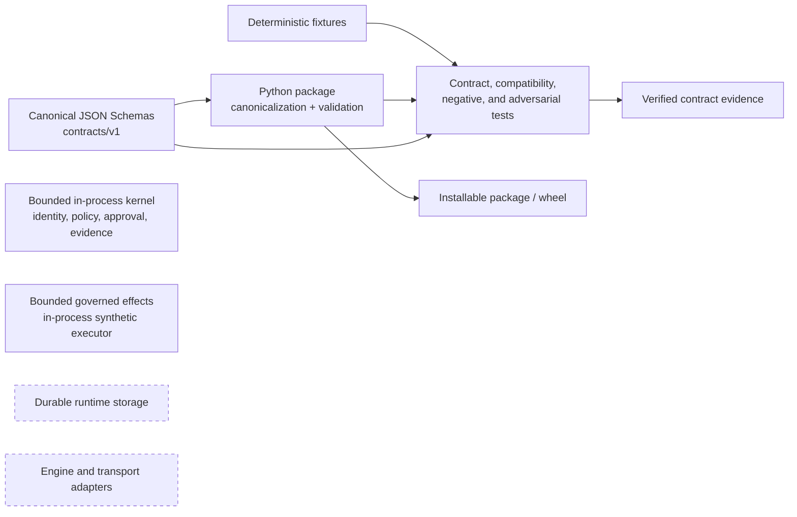
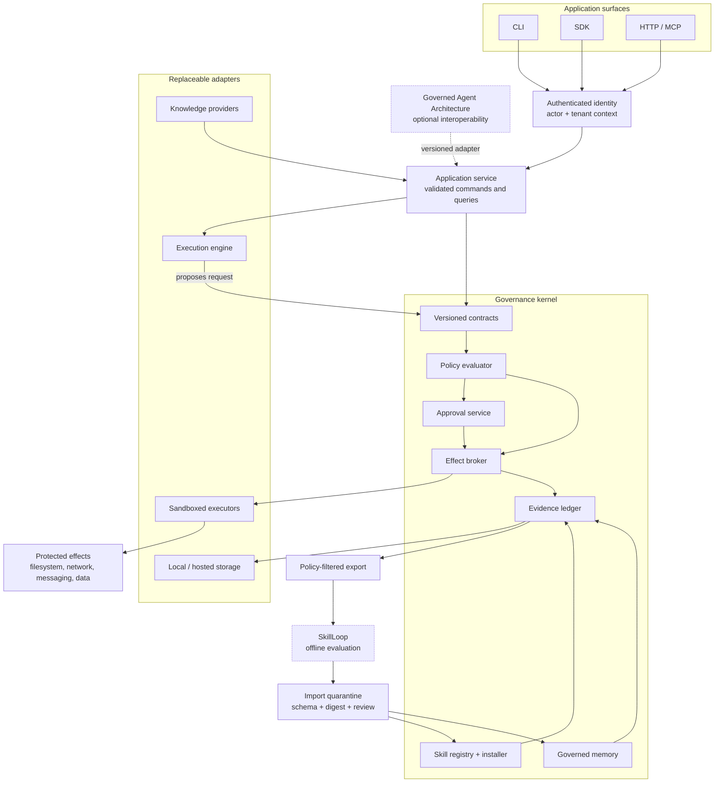
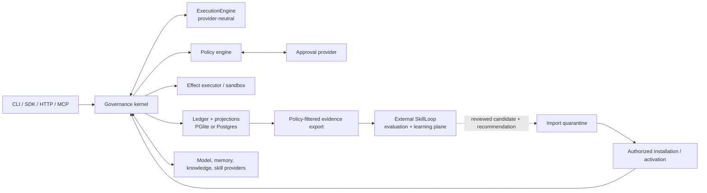
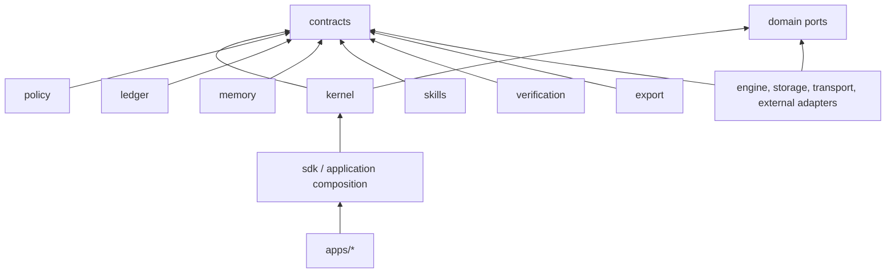
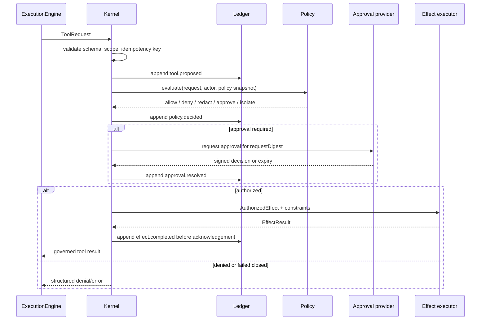

# Architecture

## Purpose

Governed Agent Harness is a local-first runtime for executing agents whose
effects, memory, skills, and learning are controlled by explicit policy and
recorded as evidence. It is a harness, not a model provider, knowledge product,
or autonomous learning system.

The architecture has three primary boundaries:

1. The **governance kernel** owns identity, policy, approvals, effect
   execution, evidence, and lifecycle state.
2. An **execution engine** proposes model turns and tool calls. It has no
   privileged access to effects or persistence.
3. **External systems** such as SkillLoop and Governed Agent Architecture
   connect through versioned adapters. They are not copied into or required by
   the kernel.

## Implementation status

The current checkout implements the contract foundation plus a bounded,
in-process governance kernel. The diagrams below intentionally separate that
shipped kernel from the target system so architecture is not confused with
runtime readiness.

### Current checkout



| Surface | Status | Boundary |
| --- | --- | --- |
| Versioned schemas and catalog | Implemented | `contracts/v1/` |
| Python models, canonicalization, and validation | Implemented | `src/governed_agent_harness/contracts/` |
| Positive, negative, compatibility, and adversarial fixtures | Implemented | `tests/contracts/` |
| Packaging and isolated wheel verification | Implemented | `pyproject.toml` and tests |
| Bounded governance kernel | Implemented | `src/governed_agent_harness/kernel/`; injected identity and current approval trust, deterministic decisions, approval consumption, and in-memory evidence lifecycle |
| Effect broker | Implemented, bounded | One in-process path issues an exact short-lived grant, appends intent evidence, consumes authority once, invokes an injected reversible synthetic executor, and appends outcome evidence |
| CLI, SDK, HTTP/MCP surfaces | Planned | Future application layer |
| Local/hosted durable storage | Planned | Future storage adapters |
| Sandbox, knowledge, and provider adapters | Planned | The current `none` isolation profile is not sandboxing and no provider executor ships |

### Target completed architecture



In the completed system, every protected effect follows the same path:

```text
surface -> identity -> validated request -> policy -> approval if required
        -> evidence append -> broker -> constrained executor -> effect result
        -> evidence append -> governed result
```

No execution engine, transport, provider, or learning system receives an
alternate path around the policy decision, evidence ledger, or effect broker.

### Delivery path

The implementation sequence below connects the current contract foundation to
the completed architecture. Arrows indicate dependency order, not release dates
or a claim that a later stage has started.

```mermaid
flowchart LR
  Foundation["1. Contract foundation\nschemas, validation, fixtures, packaging"]:::done
  Kernel["2. Governance kernel\nidentity, policy, approvals, lifecycle"]:::done
  Effects["3. Governed effects\ngrant, broker, synthetic executor, evidence"]:::done
  State["4. Durable state\nledger, projections, memory, skills"]:::planned
  Surfaces["5. Product surfaces\nCLI, SDK, HTTP, MCP, diagnostics"]:::planned
  Operations["6. Operations + integrations\nhosted tenancy, observability, recovery,\nSkillLoop and Governed Agent Architecture adapters"]:::planned
  Release["7. Stable release\nconformance, security review, migration,\nSBOM, signed artifacts, support boundaries"]:::planned

  Foundation --> Kernel --> Effects --> State --> Surfaces --> Operations --> Release

  classDef done stroke-width:2px
  classDef planned stroke-dasharray:5 5
```



| Stage | Principal deliverables | Completion evidence |
| --- | --- | --- |
| Contract foundation | Schemas, canonicalization, semantic validation, fixtures, wheel | Implemented and covered by the contract suite |
| Governance kernel | Trusted identity, deterministic policy, approvals, evidence-first in-memory lifecycle state | Implemented and covered by public-flow, negative-path, and adversarial kernel tests |
| Governed effects | Exact short-lived grant, sole broker, injected executor port, intent and outcome evidence | Implemented for one reversible in-process synthetic executor; no durable storage, provider, or sandbox proof |
| Durable state | Evidence ledger, projections, governed memory, skill lifecycle | Restart, idempotency, replay, isolation, and recovery tests |
| Product surfaces | CLI, SDK, HTTP/MCP, diagnostics, run inspection | One documented workflow through every supported surface |
| Operations and integrations | Hosted storage, tenant controls, telemetry, backup/restore, optional adapters | Cross-backend conformance and operational exercises |
| Stable release | Compatibility policy, migrations, security review, SBOM, signed artifacts | Published release evidence and explicit support boundaries |

## Design invariants

- Every effectful tool call is synchronously evaluated by policy before it can
  execute.
- The engine cannot obtain raw effect-capable tool implementations.
- Evidence is appended before derived state is projected.
- Memory promotion requires source evidence and a recorded policy decision.
- Approval is bound to an exact request digest and expires.
- Tenant and actor scope are derived from authenticated context, never trusted
  from model output or tool arguments.
- Local and hosted storage implement the same transactional contract.
- Learning output is inert until separately validated and installed.
- Public and persisted contracts are versioned.
- A failed audit write prevents the governed effect; this path fails closed.

## System context



MCP, HTTP, and the SDK enter through the same application service. No
transport is allowed to implement an alternate execution path.

## Monorepo boundaries

The intended TypeScript workspace is:

```text
apps/
  cli/                 user commands; no domain logic
  daemon/              HTTP and MCP process composition
packages/
  contracts/           canonical schemas, generated types, compatibility
  kernel/              run coordinator and lifecycle state machines
  execution-adapter/  ExecutionEngine adapter
  policy/              decisions, rules, risk, approval orchestration
  ledger/              append-only events, hashes, projections
  storage/             storage interfaces, transactions, migrations
  storage-pglite/      embedded implementation
  storage-postgres/    hosted implementation
  memory/              proposals, promotion, retrieval, supersession
  knowledge/           source and retrieval provider contracts
  skills/              manifests, resolution, integrity, installation
  verification/        deterministic runtime invariant and conformance checks
  export/              policy-filtered evidence export jobs
  sandbox/             effect executors and resource limits
  identity/            authenticated actor and tenant context
  mcp/                 MCP transport mappings
  sdk/                 public TypeScript client
  testing/             conformance fixtures and adapter test kits
adapters/
  skillloop/           offline trace export and reviewed import
  governed-memory/     optional external memory provider
  generic-jsonl/       language-neutral event interchange
schemas/               source JSON Schemas and compatibility fixtures
```

Package names may change, but ownership and dependency direction may not be
collapsed for convenience.

## Dependency direction



Rules:

- `contracts` has no dependency on runtime packages.
- The kernel depends on interfaces, never a model provider, Postgres, PGlite,
  MCP, or an external project.
- Storage and engine adapters depend inward on ports and contracts.
- Transport packages translate and authenticate; they do not decide policy.
- External adapters cannot write projections directly. They submit commands to
  the kernel.
- Import cycles are a build failure.

## Core ports

The following pseudotypes describe the stable architecture boundary. Canonical
wire shapes are defined in [Contracts](CONTRACTS.md).

```ts
interface ExecutionEngine {
  readonly capabilities: EngineCapabilities;
  start(input: EngineStart, sink: EngineEventSink): Promise<EngineSession>;
  resume(input: EngineResume, sink: EngineEventSink): Promise<EngineSession>;
  cancel(runId: RunId, reason: string): Promise<void>;
}

interface EngineSession {
  provideToolResult(result: GovernedToolResult): Promise<void>;
  provideContext(context: ContextPatch): Promise<void>;
  waitForTerminal(): Promise<EngineTerminal>;
}

interface PolicyEvaluator {
  evaluate(input: PolicyInput): Promise<PolicyDecision>;
}

interface EffectExecutor {
  execute(input: AuthorizedEffect): Promise<EffectResult>;
}

interface Ledger {
  append(tx: Transaction, event: EvidenceEnvelope): Promise<AppendReceipt>;
  read(query: LedgerQuery): AsyncIterable<EvidenceEnvelope>;
}

interface UnitOfWork {
  transact<T>(fn: (tx: Transaction) => Promise<T>): Promise<T>;
}
```

An `ExecutionEngine` emits proposals and consumes governed results. It never
receives `EffectExecutor`, database credentials, approval credentials, or raw
secrets.

## Run lifecycle

```mermaid
stateDiagram-v2
  [*] --> Created
  Created --> Running: identity and policy snapshot recorded
  Running --> WaitingApproval: exact tool request requires approval
  WaitingApproval --> Running: approved and effect completed
  WaitingApproval --> Running: denied or expired; denial returned to engine
  Running --> Running: model/tool/context event
  Running --> Cancelling: cancellation requested
  Running --> Completed: engine completed
  Running --> Failed: terminal error
  Cancelling --> Cancelled: engine and active executors stopped
  Created --> Failed: initialization failure
  Completed --> [*]
  Failed --> [*]
  Cancelled --> [*]
```



Terminal states are immutable. Resume creates or continues a persisted engine
checkpoint only when the engine capability manifest and policy permit it; it
does not rewrite terminal history.

## Tool-effect sequence



Argument redaction produces a new request and digest. A decision for the
original request never authorizes the changed request. Executor output is
size-limited, classified, and sanitized before being returned or persisted.

## Persistence model

The durable model separates:

- **Ledger:** ordered evidence envelopes that are append-only through
  application interfaces and hash-linked for tamper evidence within the
  documented threat model.
- **Projections:** rebuildable query models for runs, approvals, memories,
  skills, and import/activation status.
- **Blobs:** encrypted or content-addressed large payloads referenced by digest.
- **Checkpoints:** engine-specific opaque state, tagged with engine and schema
  versions.

The ledger is the authority for audit and recovery. Projections are optimized
views, not alternate truth. A projection records its last applied ledger
position and can be rebuilt idempotently.

Within one unit of work, the system appends an event and updates required
projections atomically. External effects cannot share that database
transaction; they use an effect idempotency key and a durable intent/result
protocol. Unknown outcomes are marked `indeterminate` and require
reconciliation rather than blind retry.

## Concurrency and ordering

- Each run has a monotonically increasing `sequence` allocated by storage.
- Append operations use optimistic concurrency with `expectedSequence`.
- Event IDs and command idempotency keys are globally unique within a tenant.
- Duplicate commands return the original receipt when the request digest
  matches; a digest mismatch is a conflict.
- A single tool proposal is resolved once. Concurrent approval responses use
  compare-and-set semantics.
- Cross-run ordering is not implied by timestamps.

## Failure handling

| Failure | Required behavior |
|---|---|
| Contract validation | Reject at boundary; append sanitized rejection when a run exists. |
| Policy unavailable | Deny effect and record fail-closed decision. |
| Ledger unavailable | Do not execute governed effect. |
| Executor timeout | Attempt cancellation; record timed out or indeterminate outcome. |
| Engine crash | Persist failure; resume only from compatible checkpoint. |
| Projection failure | Stop acknowledgement; retry projection idempotently. |
| Approval timeout | Record expiry and return denial to engine. |
| Memory provider failure | Continue only if run policy marks memory optional; never fabricate retrieval. |
| Export failure | Retry offline; it cannot change the completed run. |

Error payloads expose stable codes and correlation IDs, not secrets or raw
stack traces.

## Security boundaries

- Identity is established by CLI local ownership or authenticated daemon
  middleware before entering the kernel.
- Secrets are resolved just-in-time by a broker and passed only to the executor
  that needs them; they are never model context or ledger fields.
- Hosted storage enforces tenant scope in both application queries and database
  roles/policies.
- Local storage relies on OS ownership, restricted file permissions, and
  optional encryption; it does not claim hosted multi-tenant isolation.
- Sandboxing strength is declared as a capability. A subprocess wrapper is not
  described as isolation unless tested as such.
- Hash chains make mutation detectable but do not alone make a database
  immutable. External signed export is required for stronger audit retention.

## Extension model

Engines, storage backends, knowledge providers, and external adapters implement
explicit ports and publish capability manifests. Startup performs compatibility
negotiation and refuses unsupported required capabilities. Extensions run with
least privilege and do not receive kernel internals.

An engine adapter translates provider-specific events at its package boundary;
provider-specific objects must not cross into `contracts` or the kernel.
MCP is a transport and integration surface, not a guarantee that native tools
inside another host can be intercepted.

## Deployment modes

### Local

- CLI and optional daemon on one trusted workstation.
- PGlite-backed storage and local content-addressed blobs.
- Loopback-only daemon by default.
- Interactive terminal approvals.

### Hosted

- Stateless daemon instances behind authenticated ingress.
- Postgres storage, durable blob service, distributed approval delivery.
- Database-enforced tenant isolation and centralized secret broker.
- Background projection, reconciliation, export, and retention workers.

Both modes execute the same contract tests and state machines. See
[ADR-0004](adr/0004-local-and-hosted-storage-parity.md).

## Compatibility and evolution

- Wire contracts use semantic versions and carry `schemaVersion`.
- Persisted events are never rewritten during ordinary upgrades.
- Readers support the current major version and explicitly documented older
  majors through pure upcasters.
- Capability negotiation covers optional behavior; it does not weaken required
  invariants.
- Database migrations are forward-only, restartable, and paired with rollback
  operational guidance.
- Engine checkpoints are resumed only by a compatible adapter version.

Detailed rules are in [Contracts](CONTRACTS.md).
