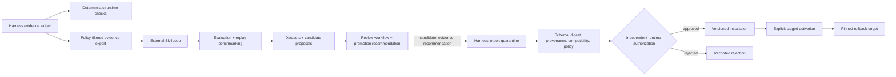
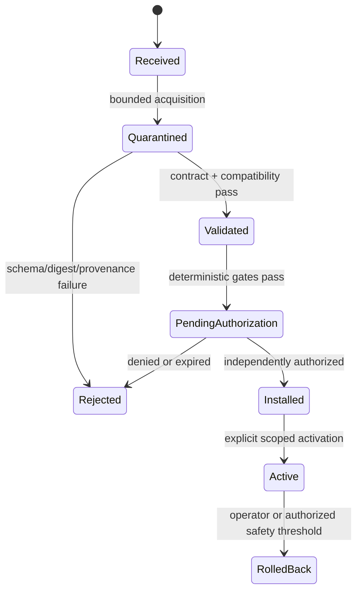

# Evaluation and Learning

## Ownership boundary

The harness and SkillLoop are separate planes with different authority.

- **Harness/runtime plane:** captures canonical evidence; enforces deterministic
  runtime invariants; exports policy-filtered evidence; quarantines imports;
  and authorizes installation, activation, staged rollout, and rollback.
- **SkillLoop/learning plane:** owns evaluation orchestration, replay
  benchmarking, datasets, proposal generation, review workflow, and promotion
  recommendation.

The harness does not deploy a general evaluation pipeline or model-assisted
evaluation service. It may run deterministic runtime, contract, conformance,
security, and artifact-validation checks required to enforce its own
invariants. These checks do not make the harness the learning plane.

## Data flow

SkillLoop output is advisory. An evaluation result, completed review, or
promotion recommendation cannot grant permissions, approve installation, or
activate runtime state. Activation always requires a separate harness decision
bound to the exact artifact digest and target scope.

## Harness-owned deterministic verification

The harness verifies properties at runtime enforcement boundaries, including:

- JSON Schema contract and output validity;
- policy evaluation, approval binding, and fail-closed behavior;
- evidence-chain integrity and required evidence references;
- tenant and authorization scope;
- artifact size, archive safety, digest, signature/provenance, permissions, and
  compatibility;
- effect idempotency and indeterminate-outcome reconciliation;
- projection rebuild determinism and local/hosted adapter conformance;
- operational limits and deterministic rollback thresholds.

Projection replay is a harness recovery mechanism. It rebuilds query state from
recorded events without external calls and is not replay benchmarking. General
task-quality scoring, model judging, benchmark orchestration, dataset curation,
and candidate comparison belong to SkillLoop.

## Export bundle

A SkillLoop or generic export contains:

- bundle manifest and JSON Schema version;
- source tenant and ledger range identifiers;
- normalized, policy-filtered event envelopes;
- referenced protected payloads only when explicitly permitted;
- component and skill version manifests;
- policy/configuration digests;
- record count and aggregate digest;
- optional signer identity and signature.

Exports are deny-by-default for secrets, credentials, private model reasoning,
and unrelated tenant data. Redaction creates a derivative value with its own
immutable digest and, where policy permits, a protected link to source
evidence. Export generation uses a consistent ledger snapshot. Retries with the
same job and filter digest produce the same logical bundle.

Evidence and ledger records are append-only through harness application
interfaces and hash-linked for tamper evidence within the documented threat
model. This is not a claim of physical or absolute immutability. Bundle values,
digests, and content-addressed artifact versions are immutable.

## SkillLoop boundary

The versioned adapter exports evidence and accepts reviewed candidate artifacts,
supporting evidence, and promotion recommendations. SkillLoop does not:

- connect to the live harness database;
- receive runtime secret-broker access;
- approve its own artifacts inside the harness;
- mutate active memory, skills, policy, or model configuration;
- authorize installation or activation;
- execute live governed effects.

Unsupported or lossy contract mappings are reported in the export or import
manifest. The canonical wire vocabulary remains defined by JSON Schema in
[Contracts](CONTRACTS.md). See
[ADR-0005](adr/0005-skillloop-remains-external.md).

## Import, installation, and activation

Validation is cheap-first: size and archive safety, digest, JSON Schema,
provenance/signature, compatibility, permissions, static policy, then required
deterministic checks. Imported executable content is never parsed or run outside
the bounded quarantine and installer path.

Installation and activation are separate decisions. Installation creates a
content-addressed version but grants no runtime exposure. Activation pins the
artifact digest, tenant/project scope, permissions, policy decision, exposure,
and rollback target. A SkillLoop recommendation is evidence for that decision,
not authorization. Automated rollback may stop or revert exposure against a
pre-authorized deterministic threshold; it cannot select or install a new
candidate.

## Failure handling

- Export failure: retry from a consistent snapshot; completed runs are
  unaffected.
- Import digest mismatch: keep quarantined and reject.
- Deterministic verification unavailable: fail the required gate; never convert
  an error into a pass.
- Partial installation: remain inactive and reconcile transactionally.
- SkillLoop unavailable: retain the durable export job; live governed runs
  continue.
- Activation regression: stop exposure, roll back to the pinned prior digest,
  and preserve the evidence trail.

SkillLoop defines benchmark integrity, dataset separation, contamination checks,
model-assisted evaluator metadata, and reporting methodology. The harness only
requires those claims to arrive as versioned, evidence-linked contract values
when policy uses them during an authorization decision.
