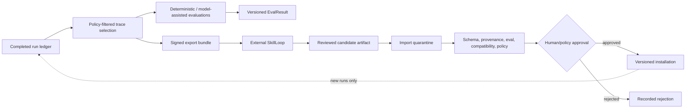
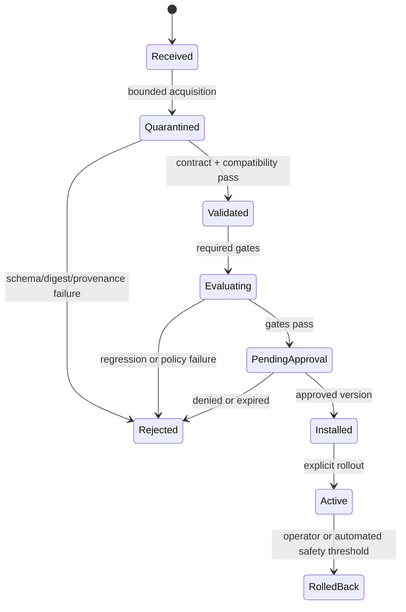

# Evaluation and Learning

## Purpose

The harness records enough evidence to evaluate task outcomes, policy
compliance, retrieval, cost, latency, and user corrections. Evaluation may
propose improvements. It never mutates the live runtime automatically.

SkillLoop remains an optional external offline evaluator and learning system.
The harness owns canonical run evidence, deterministic local checks, artifact
quarantine, and controlled installation.

## Data flow

The dashed feedback edge is never an in-place mutation. Installation creates a
new version and supports rollback.

## Evaluation classes

### Deterministic

- contract and output schema validity;
- tool success/failure and retry behavior;
- policy decision and approval compliance;
- evidence and citation presence;
- resource budgets, latency, tokens, and cost;
- memory promotion and retrieval lifecycle;
- replayed state-machine invariants.

### Reference-based

- expected tool sequence or final structured result;
- known-answer retrieval and citation correctness;
- policy test fixtures and adversarial scenarios;
- regression datasets pinned by digest.

### Model-assisted

- task quality, groundedness, or qualitative rubric scoring where deterministic
  checks are insufficient.

Model-assisted results record evaluator model, provider, prompt/config digest,
sampling parameters, evidence references, and uncertainty. They cannot be the
sole gate for critical security properties.

### Human feedback

- explicit approval/rejection;
- correction or memory dispute;
- outcome rating and structured reason;
- incident or escalation classification.

Silence, abandonment, or lack of correction is not automatically positive
feedback.

## EvalResult requirements

The canonical shape is defined in [Contracts](CONTRACTS.md). Results are
immutable and identify:

- exact run/subject digest;
- evaluator and configuration version;
- dataset and rubric digest where used;
- evidence supporting each metric;
- `pass`, `fail`, `inconclusive`, or infrastructure `error`;
- timestamps and runtime/cost metadata.

Aggregations never erase the underlying result identities. Dashboards report
sample size, missing data, and confidence where meaningful.

## Replay

Replay has explicit modes:

- **ledger replay:** rebuild projections without external calls;
- **policy replay:** reevaluate recorded requests under a pinned or candidate
  policy without executing effects;
- **model replay:** rerun the agent with mocked tools or an approved sandbox;
- **full scenario replay:** execute a deterministic test fixture in an isolated
  environment.

Production external effects are never repeated during ordinary replay. Recorded
tool results are used unless the scenario explicitly provisions safe fakes.
Replay output is a new evaluation/run linked to, not overwriting, the original.

## Export bundle

A SkillLoop or generic export contains:

- bundle manifest and schema version;
- source tenant and ledger range identifiers;
- normalized, policy-filtered event envelopes;
- referenced protected payloads only when explicitly permitted;
- component and skill version manifests;
- policy/evaluator configuration digests;
- record count and aggregate digest;
- optional signer identity and signature.

Exports are deny-by-default for secrets, credentials, private model reasoning,
and unrelated tenant data. Redaction creates a derivative payload with its own
digest and retains a protected link to source evidence where policy allows.

Export generation uses a consistent ledger snapshot. Retries with the same job
and filter digest produce the same logical bundle.

## SkillLoop boundary

The adapter may export traces and import reviewed artifacts. SkillLoop does not:

- connect to the live harness database;
- receive runtime secret-broker access;
- approve its own artifacts;
- mutate active memory, skills, policy, or model configuration;
- execute live governed effects.

The adapter version maps canonical harness contracts to a declared SkillLoop
format version. Unsupported or lossy fields are reported in the export manifest.
See [ADR-0005](adr/0005-skillloop-remains-external.md).

## Learning artifacts

Candidate types include:

- skill package or skill revision;
- memory proposal batch;
- policy bundle proposal;
- prompt/configuration proposal;
- evaluation dataset or rubric;
- fine-tuning or preference dataset export.

Every artifact carries source trace digests, producer and version, creation
method, training/evaluation data references, compatibility range, package
digest, and review status. A candidate cannot contain an executable migration
that bypasses the relevant installer.

## Import lifecycle

Validation order is cheap-first: size and archive safety, digest, schema,
provenance/signature, compatibility, static policy, deterministic evaluations,
then expensive model/scenario evaluations.

## Promotion and rollout

Promotion requirements are artifact-type and risk specific. At minimum:

- all required deterministic gates pass;
- no unresolved critical regression;
- provenance and source authorization are valid;
- permissions and data scope do not silently expand;
- compatibility is confirmed against target runtime;
- required human approval is recorded;
- rollback target is available.

Activation can be tenant/project scoped and staged. A rollout pins the artifact
digest and records exposure. Automated rollback may react to deterministic
operational thresholds, but it does not select or install a new candidate.

## Evaluation integrity

- Training and evaluation sets are separated and identified by digest.
- Contamination checks record shared sources and near-duplicates.
- Baselines and candidate configuration are pinned.
- Failed and inconclusive results remain visible.
- Reported improvements include dataset size and variance; no benchmark claim is
  published without reproducible evidence.
- Security claims require adversarial tests at the actual enforcement boundary.

## Failure handling

- Evaluator unavailable: record `error`; never convert to pass.
- Missing evidence: record `inconclusive` or fail according to gate policy.
- Export failure: retry from consistent snapshot; completed runs are unaffected.
- Import digest mismatch: quarantine and reject.
- Partial artifact install: transactionally remain inactive and reconcile.
- SkillLoop unavailable: retain durable export job; live governed runs continue
  unless explicitly configured otherwise.
- Rollout regression: stop exposure, roll back to pinned prior digest, preserve
  all evidence.

## Minimum evaluation portfolio

- task completion and structured correctness;
- policy bypass, approval binding, and fail-closed behavior;
- tenant leakage and unauthorized retrieval;
- memory poisoning, contradiction, deletion, and staleness;
- prompt injection through messages, memory, knowledge, and skills;
- effect idempotency and indeterminate reconciliation;
- replay and projection determinism;
- adapter parity and version incompatibility;
- performance budgets with measured, reproducible baselines.
