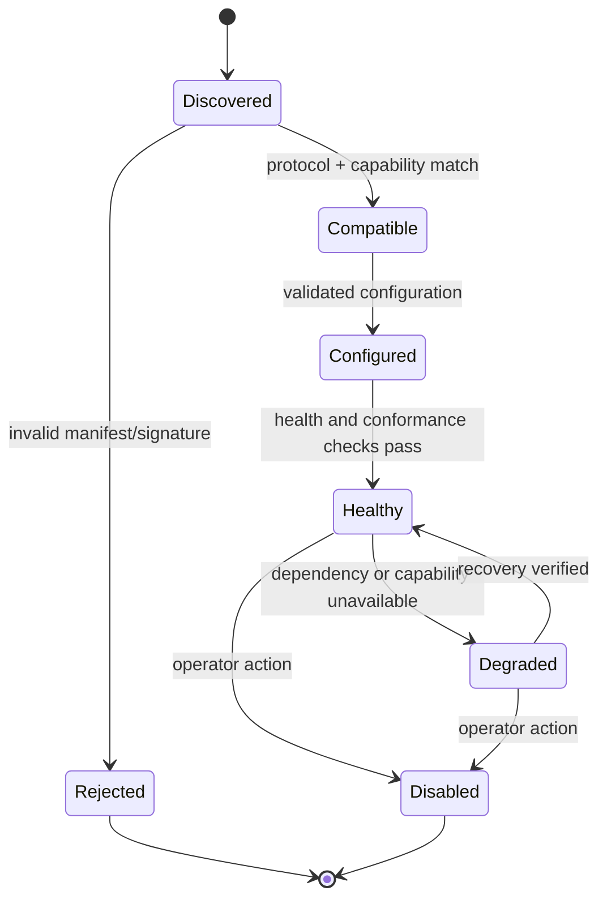

# Integrations

## Integration principles

Integrations translate at the edge; they do not weaken kernel invariants.

- Every adapter declares protocol versions, capabilities, and limitations.
- Authentication is completed before commands enter the kernel.
- External identifiers are namespaced and mapped to internal identifiers.
- Retries use idempotency keys and bounded backoff.
- Adapter failures are visible and do not imply successful governance.
- No external system receives secrets or unrestricted evidence by default.
- Governed Agent Architecture and SkillLoop remain independent projects.

## Integration levels

Support claims use four precise levels:

| Level | Meaning | Enforcement claim |
|---|---|---|
| Observe | Receives normalized events after they occur. | No prevention. |
| Advise | Supplies context, memory, or recommendations. | No effect prevention. |
| Gate | Kernel decides before the integrated effect occurs. | Effect can be denied. |
| Isolate | Effect executes in a verified controlled environment. | Declared resource boundary is enforced. |

An MCP server exposed to another agent is usually Observe/Advise unless that
host routes its effectful tools through the harness. Documentation must not call
such an integration Gate or Isolate.

## Execution engine integration

`ExecutionEngine` is defined in [Architecture](ARCHITECTURE.md). An adapter is
responsible for:

- translating input messages and model configuration;
- emitting normalized model, message, and tool proposal events;
- pausing while a governed tool result is pending;
- accepting context patches and governed tool results;
- cancellation and terminal state reporting;
- checkpoint compatibility declarations;
- sanitizing engine-specific failures.

The engine receives only proxy tools. The proxy serializes a `ToolRequest` to
the kernel; only the kernel can resolve an authorized request to an
`EffectExecutor`.

### Pi adapter

Pi is the first reference engine and remains an upstream dependency behind
`packages/execution-pi`.

The adapter maps Pi lifecycle and tool hooks to canonical events, disables or
wraps effectful native tools, and verifies at startup that every enabled
effectful tool is proxied. A conformance test deliberately registers a native
effectful tool and must prove startup rejection or interception.

Pi session/checkpoint data is opaque to the kernel and tagged with:

- Pi package version;
- adapter version;
- canonical protocol version;
- checkpoint format version.

No Pi type appears in public SDK signatures or persisted canonical payloads.

## Transport surfaces

### TypeScript SDK

The SDK is the primary embedded interface. It offers typed commands, queries,
event subscriptions, and explicit lifecycle management. It does not export
database clients or executor internals.

```ts
const harness = await createHarness(config);
const run = await harness.runs.start({ agent, input });
for await (const event of run.events()) { /* normalized envelopes */ }
await harness.close();
```

### HTTP

The daemon exposes versioned routes under `/v1`. It uses authenticated subject
context, request size limits, schema validation, idempotency headers, stable
errors, and cursor-based event reads. Streaming uses server-sent events or a
documented WebSocket subprotocol; clients can resume from the last ledger
position.

HTTP handlers call the same application commands as the SDK. Administrative
routes use separate scopes and cannot be invoked with run-only credentials.

### MCP

MCP maps selected commands and queries into tools and resources:

- resources for capabilities, run summaries, approved memory, and skill
  metadata;
- tools for starting/cancelling runs, proposing memory, requesting retrieval,
  and resolving approvals where policy permits;
- prompts only as convenience templates, never authority.

MCP input is untrusted. The server authenticates its peer where the transport
supports it and maps the session to an `ActorContext`. Stdio defaults to local
OS ownership; remote MCP requires authenticated transport. Tool descriptions
must clearly state effects and approval behavior.

MCP does not expose raw ledger payloads, secrets, or unrestricted memory search
without explicit scopes.

## Storage adapters

PGlite and Postgres implement one storage port and conformance suite. Adapters
own connection management and migrations but not domain decisions. Details are
in [ADR-0004](adr/0004-local-and-hosted-storage-parity.md).

## Knowledge provider integration

```ts
interface KnowledgeProvider {
  capabilities(): Promise<CapabilityManifest>;
  ingest(command: GovernedIngestCommand): Promise<IngestReceipt>;
  search(query: KnowledgeQuery): Promise<KnowledgeResult[]>;
  getSource(sourceId: string): Promise<KnowledgeSource | null>;
  delete(command: GovernedDeleteCommand): Promise<DeleteReceipt>;
}
```

Results must carry source identity, revision, evidence location, retrieval score,
and provider metadata. The kernel applies actor/tenant scope and output policy
even if the provider also enforces access control.

An optional GBrain adapter may implement this interface. GBrain remains
separately installed and versioned. Provider-specific synthesis is labeled as
derived content, not source evidence.

## Governed Agent Architecture adapter

The existing Governed Agent Architecture repository is not a dependency of the
kernel. A future adapter may use its memory service as an external provider.
That adapter must:

- map its memory types to canonical types without losing provenance;
- declare whether tenant enforcement occurs remotely;
- avoid treating its service-role database access as harness authorization;
- represent unsupported lifecycle fields explicitly;
- pass provider conformance and tenant-leakage tests.

No direct reads of its database tables are allowed from the kernel.

## SkillLoop adapter

SkillLoop remains an offline evaluation and learning system. The adapter has two
one-way flows:

1. Export completed, policy-filtered traces to a versioned SkillLoop-compatible
   bundle.
2. Import reviewed artifacts into quarantine for validation and installation.

It does not receive live credentials, mutate active skills, write memory, or
change policy. See [Evaluation and Learning](EVALUATION_AND_LEARNING.md) and
[ADR-0005](adr/0005-skillloop-remains-external.md).

## Generic JSONL adapter

The language-neutral interchange format is newline-delimited canonical
envelopes with a header record containing export version, source ledger range,
filter policy digest, and manifest digest. An export ends with a trailer record
containing record count and aggregate digest.

Import is streaming, bounded, and transactional at bundle granularity. Invalid
records, unsupported versions, digest mismatches, or cross-tenant references
reject the bundle. Partial imports are not made visible.

## Adapter lifecycle



An unhealthy required adapter prevents startup. An optional adapter can be
disabled with an explicit degraded-status event.

## Configuration and secrets

Adapter configuration is schema-validated. Secret fields contain references,
not values. Resolution occurs at the last responsible moment through a secret
broker. Diagnostics redact configured sensitive paths and known credential
patterns.

Configuration precedence is deterministic: explicit invocation, environment,
project configuration, user configuration, defaults. `doctor` displays sources
without displaying secret values.

## Compatibility matrix

Each adapter release publishes:

| Field | Example |
|---|---|
| Adapter version | `1.2.0` |
| Protocol range | `>=1.1 <2` |
| Upstream range | Pi `>=x <y` |
| Integration level | Gate |
| Required kernel capabilities | `tool.pause`, `effect.proxy` |
| Known limitations | no checkpoint resume across major Pi upgrade |

Continuous integration tests the lowest and highest supported dependency
versions. Unsupported combinations fail during negotiation, not during a run.

## Failure and retry rules

- Read-only queries may retry transient failures with bounded exponential
  backoff.
- Commands retry only with stable idempotency keys.
- External effect timeouts are not assumed to have failed; they become
  `indeterminate` until reconciled.
- Export and evaluation jobs use a durable outbox and dead-letter state.
- Circuit breakers may protect optional providers, but cannot bypass policy or
  ledger requirements.
- Health checks distinguish liveness, readiness, and dependency degradation.

## Integration acceptance criteria

An integration is supported only after it has:

- schema and capability fixtures;
- authentication and tenant-boundary tests;
- retry/idempotency tests;
- timeout and partial-failure tests;
- redaction tests;
- version compatibility tests;
- documented integration level and limitations;
- an uninstall/disable path that preserves ledger readability.
