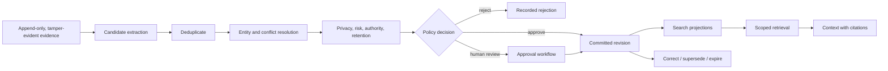
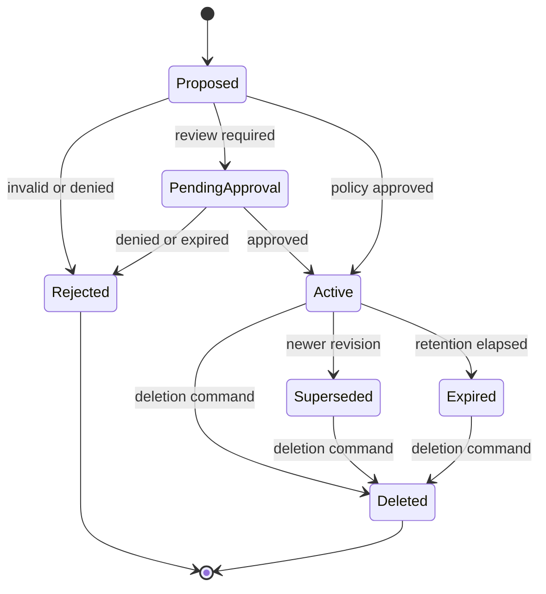

# Memory and Knowledge

## Purpose and separation

Memory is governed agent state derived from evidence. Knowledge is sourced
material that can be searched and cited. They may share retrieval infrastructure
but have different authority and lifecycle rules.

- **Semantic memory:** durable claims, preferences, or relationships.
- **Episodic memory:** bounded records of events and outcomes.
- **Procedural memory:** reviewed instructions or strategies.
- **Knowledge source:** externally sourced content with identity and revision.

Conversation history is evidence, not automatically trusted memory. Retrieved
knowledge is context, not permission.

## Lifecycle



Every transition records a canonical event. Extraction and classification can
be deterministic or model-assisted, but their output remains a proposal.

## Evidence requirements

A proposal is invalid unless it contains at least one resolvable evidence
reference whose tenant matches the proposal. Evidence spans identify the exact
supporting region where applicable. Generated summaries link both the source
evidence and the derivation metadata.

Evidence authority is explicit:

- `observed`: directly recorded by an authorized system.
- `user_asserted`: stated by a user but not independently verified.
- `derived`: inferred from other evidence.
- `imported`: introduced through a reviewed external artifact.

Confidence does not upgrade authority. Multiple weak sources are not silently
converted into verified fact.

## Promotion policy

Promotion evaluates:

- authenticated actor and target scope;
- memory type and content schema;
- source authority and evidence integrity;
- sensitivity and prohibited-data rules;
- contradiction and duplication results;
- retention and expiry requirements;
- proposer trust level;
- human approval thresholds.

The decision is bound to the proposal digest. Changed content or scope requires
a new decision. A model cannot promote its own proposal by emitting a tool call
that bypasses this policy.

## Revision and conflict model

Committed memory is append-only by revision. Updates create a new revision and
link `supersedes`; prior revisions remain auditable subject to deletion policy.

Conflicts are represented, not overwritten:

- `duplicate`: equivalent content within the same scope;
- `refines`: adds compatible specificity;
- `contradicts`: cannot simultaneously be true for the same validity interval;
- `supersedes`: a newer authoritative revision replaces an older one;
- `unrelated`: no lifecycle relationship.

Automatic resolution is allowed only for deterministic rules such as exact
content digest duplication or expiry. Authority-sensitive contradictions
require policy or human resolution.

## Scope and authorization

Memory scope is part of identity, not a search filter supplied by the caller.
The implemented Phase 4 slice exposes only
`retrieve_memory(actor_context, memory_query)`: it schema-validates the
`ActorContext`, derives tenant and actor scope from it, and currently accepts
only its exact actor-level scope. PostgreSQL maps each runtime login to that one
tenant/actor pair, forces RLS, and permits retrieval only through a fixed
search-path read function. The caller never supplies SQL tenant authority.

Cross-tenant retrieval is forbidden. Shared memories use explicit group or
project grants; they are not created by omitting `actorId`. Retrieval results
carry the scope used to authorize them.

## Retrieval

The implemented query and record contracts are canonical JSON Schema models.
The PostgreSQL reader selects the latest revision per record, excludes
tombstoned, expired, retention-expired, and temporally out-of-bounds records,
filters declared categories, and returns a deterministic lexical score/order.
Both the record validity expiry and retention expiry are authoritative retrieval
ceilings. Results preserve the committed record's source-evidence and policy
provenance, revision, scope, and lifecycle state. It is deliberately offline
and provider-neutral: there is no embedding or model. Promotion is a separate
authority-only API; runtime retrieval remains read-only.

Retrieval output is capped by count and token/byte budget. Content is labeled as
untrusted context so that stored prompt injection is not treated as instruction.
Procedural memory does not become executable permission.

## Knowledge sources

A source has stable identity separate from content revision:

```ts
type KnowledgeSource = {
  sourceId: string;
  canonicalUri: string;
  sourceType: string;
  ownerScope: string;
  accessPolicyId: string;
};

type KnowledgeRevision = {
  sourceId: string;
  revisionId: string;
  contentDigest: string;
  observedAt: string;
  validFrom?: string;
  mediaType: string;
  provenance: Record<string, string>;
};
```

Repeated ingestion of the same source revision is idempotent. Changed content
creates a revision. Chunk identities derive from revision and stable location,
not mutable array position alone.

## Provider boundary

This repository currently ships only the optional PostgreSQL read path above.
No local PGlite provider, hosted deployment, or external provider adapter is
implemented. Any future provider must retain the narrow actor-context boundary
and cannot bypass promotion policy or ledger events.

Provider capability manifests declare:

- supported memory types and filters;
- lexical, vector, graph, and temporal search support;
- transactional and deletion guarantees;
- maximum payload and query limits;
- tenant enforcement behavior;
- index and embedding compatibility.

Missing required behavior fails configuration validation.

## Phase 4.3 promotion boundary

Phase 4.2 intentionally has no runtime memory-write API. Phase 4.3 implements the
smallest governed promotion boundary with these invariants:

- a schema-valid `MemoryProposal` references resolvable same-tenant, same-actor
  whole-payload source evidence;
- the policy decision and any approval bind the exact proposal digest, actor,
  scope, retention, validity, and requested lifecycle operation;
- the runtime role retains no direct table DML and cannot call promotion
  functions; only the distinct authority path may create, revise, supersede, or
  tombstone records;
- canonical promotion evidence and the authoritative memory revision are
  committed atomically with optimistic concurrency and idempotency; and
- failures, conflicts, stale revisions, expired authority, and validation errors
  produce no record, invalid transition, or alternate authorization truth.

The evidence ledger remains authoritative. The PostgreSQL memory and transition
tables are rebuildable projections. Automatic promotion, model self-approval,
provider integration, embeddings, and shared/project scopes are outside this
slice. Cross-memory supersession, partial evidence spans, physical deletion,
and cryptographic erasure fail closed rather than claim unsupported semantics.

## Indexing and consistency

Committed records are authoritative before their search indexes. The implemented
promotion path appends canonical evidence and its durable record projection in
one transaction. Phase 4.3 creates no provider index or indexing task. A future
indexed provider may declare a consistency mode:

- `committed`: query authoritative fields, possibly with reduced ranking;
- `indexed`: require projection to have reached a supplied ledger position;
- `eventual`: accept the latest available index and report its position.

Index failures do not discard committed memory. They are observable and
retryable. Reindexing is idempotent and versioned by index configuration.

## Privacy, retention, and deletion

- Data is classified before promotion.
- Secret-like content is rejected or stored only through an approved protected
  reference; secret values never enter model-visible memory.
- Retention class and expiry are mandatory.
- Expiry removes records from active retrieval and records an event.
- Deletion propagates to indexes, caches, blobs, and provider replicas.
- Minimal tombstones retain identifiers and deletion proof only when policy and
  law permit.
- Derived memories are linked so deletion impact can be evaluated and applied.

Embedding vectors can leak information and follow the same classification and
deletion lifecycle as source content.

## Memory state machine



## Failure behavior

- Evidence missing or unverifiable: reject proposal.
- Classifier unavailable: keep proposal pending; do not promote.
- Search index unavailable: use declared committed fallback or return degraded
  retrieval; do not fabricate an empty result as success.
- Provider timeout: retry read according to policy and expose degradation.
- Ambiguous external write outcome: reconcile by idempotency key.
- Conflict resolver error: preserve both active candidates and block promotion
  if policy requires a single truth.
- Deletion propagation failure: mark deletion incomplete, prevent retrieval,
  and continue reconciliation.

## Required evaluations

- evidence precision and unsupported-memory rejection;
- cross-tenant and unauthorized-scope leakage;
- contradiction detection and supersession correctness;
- prompt-injection resistance in retrieved content;
- deletion and derived-data propagation;
- retrieval relevance, citation correctness, and staleness;
- parity between PGlite and Postgres;
- deterministic replay of promotion decisions.
