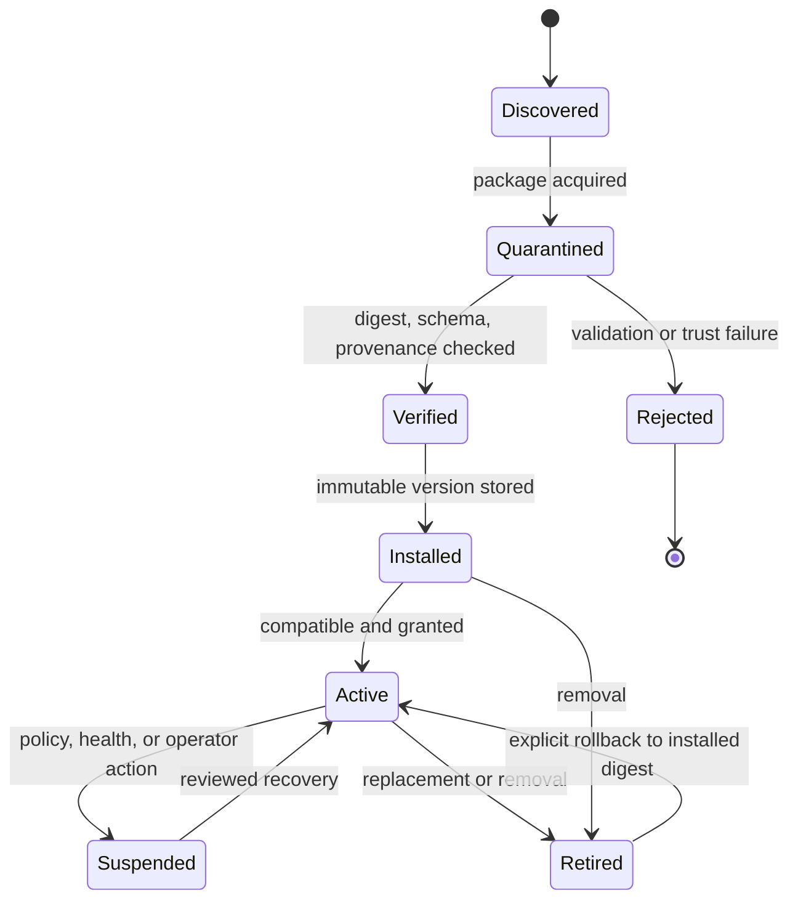

# Skills

## Definition

A skill is a versioned, integrity-addressed package that contributes agent
instructions, schemas, resources, and optional governed tool implementations.
A skill is not trusted merely because it is installed, signed, or written in
Markdown.

The skill system separates:

- **discovery:** finding package metadata;
- **verification:** validating structure, digest, provenance, and signatures;
- **installation:** placing an immutable version in the local registry;
- **granting:** approving a subset of requested permissions;
- **activation:** making the version available to a configured agent;
- **execution:** routing every effect through normal policy gates;
- **upgrade/rollback:** changing the active immutable version explicitly.

## Package format

```text
skill-package/
  skill.json                 canonical SkillManifest
  instructions.md           model-facing guidance
  schemas/
    input.schema.json
    output.schema.json
  resources/                 optional non-executable assets
  tools/                     optional executable entrypoints
  tests/
    fixtures/
    expected/
  provenance.json
  signatures/                optional detached signatures
```

The published archive is content-addressed. Paths are normalized; absolute
paths, traversal, links escaping the package, device files, and duplicate
normalized names are rejected. Archive expansion has file-count and byte limits.

The canonical manifest shape is defined in [Contracts](CONTRACTS.md).

## Permissions

Permissions are explicit requests, not grants. Examples:

```ts
type PermissionRequest =
  | { kind: "filesystem.read"; patterns: string[] }
  | { kind: "filesystem.write"; patterns: string[] }
  | { kind: "network.connect"; hosts: string[]; ports?: number[] }
  | { kind: "process.execute"; commands: string[] }
  | { kind: "secret.use"; names: string[] }
  | { kind: "external.message"; destinations: string[] }
  | { kind: "memory.propose"; types: string[] };
```

An installation grant records the approved subset, actor, tenant, project,
policy version, package digest, and expiry. Runtime policy can further narrow
the grant. Neither the manifest nor an engine can widen it.

## State machine



Installation never activates automatically. Upgrade installs a new version
alongside the old one; it does not mutate the existing package.

## Resolution

A run pins exact skill package digests at creation. Resolution considers:

- configured version range;
- protocol and execution-engine compatibility;
- required capabilities;
- active permission grant;
- tenant/project policy;
- revoked publisher keys or package digests;
- deterministic conflict rules.

The result and dependency graph are recorded in `skill.resolved`. A running
session does not float to a newer version. New versions affect new runs after
explicit activation.

Dependencies must be declared with version ranges and package identities.
Resolution produces a lockfile. Cycles, ambiguity, dependency confusion, and a
dependency requesting undeclared transitive permissions are errors.

## Execution boundary

Model-facing instructions are untrusted context. Optional tool code runs only
through a compatible `EffectExecutor` and uses proxy capabilities. It does not
receive kernel objects, storage clients, raw credentials, or unrestricted host
APIs.

Each tool invocation is validated against the skill's tool schema and passes
through the same `ToolRequest -> PolicyDecision -> AuthorizedEffect` lifecycle
as built-in tools. A previously granted skill can still require per-call human
approval.

If the configured environment cannot enforce a requested isolation level, the
skill cannot activate. A process boundary without tested resource controls is
not labeled a sandbox.

## Trust and provenance

Verification checks:

- package digest and manifest consistency;
- source repository/revision and build metadata;
- publisher signature where present;
- publisher key trust and revocation state;
- schema validity and contract compatibility;
- static policy checks and prohibited file types;
- declared tests and harness conformance tests.

A signature authenticates a key-to-package assertion. Policy determines whether
the key is trusted for a tenant, skill name, risk level, and permission class.
Unsigned local skills may be allowed under a visibly different trust policy.

## Inputs, outputs, and context

Skill inputs and outputs use JSON Schema and are validated at runtime. The
kernel applies sensitivity and size limits before data enters model context or
the ledger. Instructions cannot interpolate raw secrets.

Skills can request memory retrieval or propose memory through governed ports.
They cannot directly read storage, commit memory, install other skills, or
change their own permission grants.

## Testing requirements

Every skill contains deterministic fixtures for its routing and structured
interfaces. Higher-risk skills also require adversarial tests.

The platform conformance suite tests:

- manifest and archive validation;
- path traversal and archive bomb rejection;
- permission request/grant mismatch;
- attempts to access undeclared resources;
- tool schema validation and output limits;
- secret exfiltration and log redaction;
- engine and protocol version incompatibility;
- deterministic resolution and lockfile replay;
- upgrade, revocation, suspension, and rollback;
- prompt injection in instructions and resources.

Passing tests is evidence for a specific package digest and environment. It is
not a universal security certification.

## Distribution and registry

The initial registry is local and content-addressed. Remote registries are
metadata and blob sources, not trust authorities. Download happens into
quarantine with limits and digest verification before parsing executable
content.

Registry operations are auditable and idempotent. Uninstall deactivates the
skill and removes unreferenced package data according to retention policy; it
does not erase historical run manifests or ledger evidence.

## Failure handling

- Package validation failure: quarantine and record a sanitized rejection.
- Signature service unavailable: do not activate when signature is required.
- Capability mismatch: fail activation with exact missing capabilities.
- Runtime policy outage: deny effectful calls.
- Tool crash/timeout: contain, record, and return structured failure.
- Revocation discovered during a run: block new calls and apply configured run
  cancellation policy; preserve evidence.
- Upgrade failure: leave the prior active version unchanged.

## SkillLoop relationship

SkillLoop may produce candidate skill artifacts offline. Imported candidates
enter quarantine and follow the same verification, granting, activation, and
rollback lifecycle as any other package. Evaluation success never grants
permissions or directly activates a skill.
